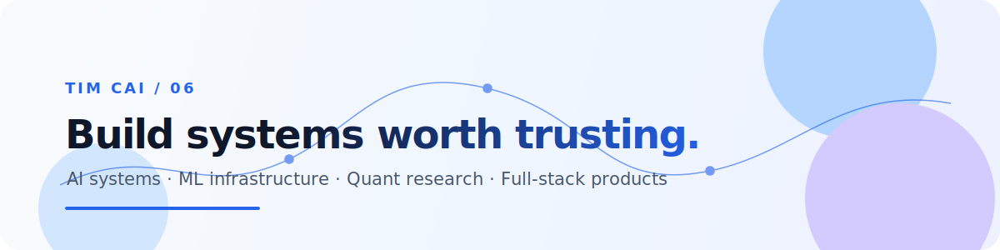

  <picture>
    <source media="(prefers-color-scheme: dark)" srcset="./assets/profile-hero-dark.svg">
    <source media="(prefers-color-scheme: light)" srcset="./assets/profile-hero-light.svg">
    
  </picture>

  
  

  

## About

I'm Tim, a student developer based in Shanghai. I build research agents, ML observability tools, quantitative systems, and polished full-stack products — with a preference for tools that make complex work easier to inspect and trust.

> [!NOTE]
> Currently focused on evidence-grounded research workflows, local-first ML tooling, and systems that turn experiments into usable products.

## Selected work

<b>🔭 SciScope</b> — an evidence-grounded literature research agent

 

SciScope helps researchers move from papers to verifiable answers: a Python RAG backend pairs with a cross-platform Go TUI, with evidence and source traceability kept at the center of the experience.

[`Python`](https://github.com/Timcai06/SciScope) · `RAG` · `DeepSeek` · `Go` · `Research Infrastructure`

[Explore SciScope →](https://github.com/Timcai06/SciScope)

<b>📈 PulseGraph</b> — local-first PyTorch training observability

 

PulseGraph turns a training run into something you can inspect: model graphs, metrics, experiment history, and a readable view of what the model is doing while it learns.

[`PyTorch`](https://github.com/Timcai06/PulseGraph) · `ML Observability` · `Visualization` · `Experiment Tracking`

[Explore PulseGraph →](https://github.com/Timcai06/PulseGraph)

<b>🌉 BDI</b> — drone-based bridge inspection with computer vision

 

An end-to-end bridge inspection workflow built around YOLOv8 segmentation, with a Next.js frontend and Django backend for taking defect detection beyond a model demo.

[`YOLOv8`](https://github.com/Timcai06/BDI) · `Computer Vision` · `Django` · `Next.js`

[Explore BDI →](https://github.com/Timcai06/BDI)

## Working with

  
  
  
  
  
  
  
  

<b>中文简介</b>

 

你好，我是 Tim，目前在上海学习和构建产品。我关注有证据链的 AI 研究工具、机器学习训练可观测性、量化研究系统，以及能够真正落地使用的全栈产品。

我相信：每个仓库都可以从一次学习实验，成长为一个值得被使用的工具。

  Build carefully. Measure honestly. Keep learning.

